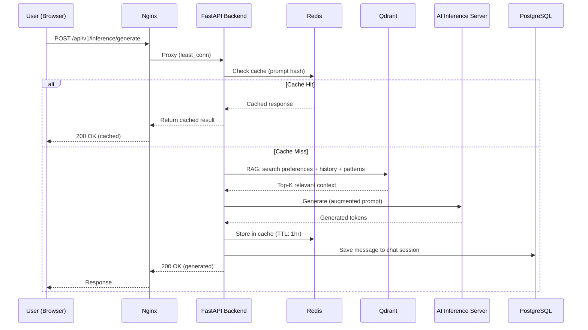

# System Architecture Document

## 1. High-Level Architecture

Prompt Polisher follows a **microservices-inspired monorepo** architecture with four distinct service layers communicating over HTTP, WebSocket, and gRPC.

```
┌────────────────────────────────────────────────────────────────────────────┐
│                         SYSTEM ARCHITECTURE                                │
│                                                                            │
│  ┌──────────────┐     HTTPS / WSS      ┌──────────────────┐               │
│  │   Browser     │ ──────────────────► │  Nginx (LB)       │               │
│  │   (Next.js)   │ ◄────────────────── │  :80 / :443       │               │
│  └──────────────┘                      └────────┬─────────┘               │
│                                                 │                          │
│                                    ┌────────────┴────────────┐             │
│                                    │                         │             │
│                               ┌────▼────┐             ┌─────▼───┐         │
│                               │ FastAPI │             │ FastAPI │         │
│                               │ Node A  │             │ Node B  │         │
│                               │  :8000  │             │  :8000  │         │
│                               └────┬────┘             └────┬────┘         │
│                                    │                       │               │
│                    ┌───────────────┼───────────────────────┤               │
│                    │               │                       │               │
│              ┌─────▼─────┐  ┌─────▼─────┐  ┌─────────────▼─┐             │
│              │ PostgreSQL │  │   Redis   │  │    Qdrant     │             │
│              │   :5432    │  │   :6379   │  │  :6333/:6334  │             │
│              └───────────┘  └───────────┘  └───────────────┘             │
│                                    │                                       │
│                              ┌─────▼─────┐                                │
│                              │  Celery   │                                │
│                              │  Workers  │                                │
│                              └─────┬─────┘                                │
│                                    │                                       │
│                              ┌─────▼─────────────┐                        │
│                              │ AI Inference Server│                        │
│                              │  :8001 (PyTorch)   │                        │
│                              └───────────────────┘                        │
│                                                                            │
│  ┌──────────────────────────────────────────────────────────────┐          │
│  │  Monitoring: Prometheus (:9090) + Grafana (:3001)            │          │
│  └──────────────────────────────────────────────────────────────┘          │
└────────────────────────────────────────────────────────────────────────────┘
```

---

## 2. Technology Decisions

### Why Each Technology Was Chosen

| Component | Technology | Rationale | Alternatives Considered |
|-----------|-----------|-----------|------------------------|
| **Frontend** | Next.js 14 (App Router) | Server components, file-based routing, built-in image optimization, excellent DX | Vite + React (no SSR), SvelteKit (smaller ecosystem) |
| **Styling** | SCSS Modules | Component scoping, design tokens via CSS vars, no runtime cost | Tailwind (utility overload for a complex UI), CSS-in-JS (runtime cost) |
| **Animations** | Framer Motion + GSAP | Framer for declarative React animations; GSAP for complex timelines (landing page) | React Spring (less intuitive API), Lottie (overkill for UI animations) |
| **State** | Zustand | Lightweight (2KB), no boilerplate, perfect for auth state | Redux Toolkit (too heavy for this scope), Jotai (atomic model not needed) |
| **Backend** | FastAPI (Python) | Native async, auto OpenAPI docs, Pydantic validation, Python AI ecosystem | Express.js (no type validation), Django (too monolithic), Flask (no async) |
| **ORM** | SQLAlchemy 2.0 (async) | Mature, async support, Alembic migrations, type hints | Tortoise ORM (less mature), Prisma (JS only) |
| **Database** | PostgreSQL 16 | ACID, JSON support, full-text search, mature ecosystem | MySQL (fewer features), MongoDB (no ACID for transactions) |
| **Cache** | Redis 7 | In-memory speed, pub/sub for Celery, rate limiting, session store | Memcached (no persistence), Valkey (too new) |
| **Vector DB** | Qdrant | Purpose-built for embeddings, gRPC support, payload filtering | Pinecone (cloud-only, cost), Weaviate (heavier), pgvector (query limitations) |
| **Task Queue** | Celery + Redis | Mature, reliable, Redis as broker, good Python integration | Dramatiq (smaller community), RQ (simpler but less features) |
| **AI Framework** | PyTorch (custom model) | Full control over architecture, educational value, GPU acceleration | HuggingFace Transformers (black-box for a thesis), TensorFlow (less Pythonic) |
| **Tokenizer** | SentencePiece (BPE) | Industry standard, vocabulary control, language-agnostic | tiktoken (OpenAI-specific), WordPiece (less flexible) |
| **Embeddings** | sentence-transformers (all-MiniLM-L6-v2) | Good quality/speed tradeoff, 384-dim, free | OpenAI Ada (API cost), E5 (larger model) |
| **Load Balancer** | Nginx | Industry standard, WebSocket support, SSL termination, static file serving | HAProxy (overkill), Traefik (auto-discovery not needed) |
| **Monitoring** | Prometheus + Grafana | Open-source, pull-based metrics, rich dashboards | Datadog (cost), ELK Stack (different purpose) |
| **CI/CD** | GitHub Actions | Integrated with repo, free for open source, YAML config | Jenkins (self-hosted overhead), GitLab CI (different platform) |

---

## 3. Data Flow

### Prompt Generation (Critical Path)

```
User types prompt → Next.js sends to FastAPI → RAG Pipeline retrieves context
  → Context + Prompt merged → Sent to AI Inference Server
  → Model generates tokens → Streamed back via WebSocket
  → Frontend renders with typewriter effect
  → User provides feedback → Stored for DPO training
```

### Detailed Sequence



### Authentication Flow

```
Register → Hash password (bcrypt) → Store in PostgreSQL
Login → Verify password → Issue JWT (access: 30min, refresh: 7d)
Request → Attach JWT → Middleware validates → Extract user
401 → Auto-refresh via interceptor → Retry original request
```

### DPO / RLHF Training Loop

```
User gives feedback (thumbs up/down) → Stored in PostgreSQL
  → Celery task exports (prompt, chosen, rejected) triples
  → DPO trainer runs on GPU (frozen reference model + trainable policy)
  → New checkpoint saved → A/B testing framework serves both versions
  → Better model promoted to production
```

---

## 4. Key Design Trade-offs

### Custom Model vs. Fine-tuning an Existing LLM

| Approach | Pros | Cons |
|----------|------|------|
| **Custom Transformer (chosen)** | Full architectural control, educational value, no API costs, no dependency on external services | Smaller model, lower quality than GPT-4, requires GPU for training |
| **Fine-tune GPT-3.5/4** | Higher quality output immediately | API costs, no architectural learning, vendor lock-in, can't run offline |
| **LoRA on open-source LLM** | Good quality with lower compute | Still large model (7B+), harder to fit on laptops |

**Decision:** Custom ~23M parameter model gives the team full control and demonstrates understanding of the transformer architecture — ideal for a thesis/final-year project.

### Monorepo vs. Polyrepo

| Approach | Pros | Cons |
|----------|------|------|
| **Monorepo (chosen)** | Single clone, atomic commits across services, shared configs | Larger repo size, need careful CI/CD scoping |
| **Polyrepo** | Independent deployment, cleaner Git history per service | Complex cross-service changes, version coordination overhead |

**Decision:** Monorepo simplifies team coordination and ensures all services are always in sync.

### SQLite (Testing) vs. PostgreSQL (Production)

Tests use in-memory SQLite via `StaticPool` for speed, while production uses PostgreSQL. This trade-off was accepted because:
- All queries use SQLAlchemy ORM (no raw SQL)
- Migration testing is done separately against PostgreSQL
- Test speed is 10x faster with in-memory SQLite

### WebSocket vs. Server-Sent Events (SSE)

| Approach | Pros | Cons |
|----------|------|------|
| **WebSocket (chosen)** | Full duplex, stop-generating support, lower latency | Sticky sessions needed, more complex |
| **SSE** | Simpler, HTTP-based, no sticky sessions | Unidirectional, can't send stop signal mid-stream |

**Decision:** WebSocket enables the "Stop Generating" button and future real-time features.

---

## 5. Security Architecture

```
┌─────────────────────────────────────────────────────────────┐
│                    SECURITY LAYERS                           │
│                                                             │
│  Layer 1: Network (Nginx)                                   │
│    • HTTPS/TLS 1.2+ with modern cipher suites               │
│    • Security headers (X-Frame-Options, CSP, HSTS)          │
│    • Rate limiting at reverse proxy level                    │
│    • Client body size limit (10MB)                           │
│                                                             │
│  Layer 2: Application (FastAPI)                              │
│    • JWT authentication (access + refresh tokens)            │
│    • OAuth 2.0 (Google, GitHub)                              │
│    • Pydantic input validation on every endpoint             │
│    • CORS middleware (whitelisted origins)                    │
│    • Rate limiting per user (Redis-backed, 50 req/min)       │
│    • Request ID tracking for audit trail                     │
│                                                             │
│  Layer 3: Data (PostgreSQL + Redis)                          │
│    • bcrypt password hashing (12 rounds)                     │
│    • Fernet AES encryption for API keys at rest              │
│    • Parameterized queries (SQLAlchemy ORM)                  │
│    • Database connection pooling with overflow limits         │
│                                                             │
│  Layer 4: Infrastructure                                     │
│    • Self-signed SSL for dev, Let's Encrypt for production   │
│    • Docker network isolation (bridge network)               │
│    • Firewall rules restricting DB ports to LAN only         │
│    • No secrets in code (env vars + .env files)              │
│    • Dependency vulnerability scanning (pip audit, npm audit)│
└─────────────────────────────────────────────────────────────┘
```

---

## 6. Scalability Considerations

| Dimension | Current (4 Laptops) | Future (Cloud) |
|-----------|---------------------|----------------|
| **Horizontal scaling** | 2 backend nodes behind Nginx | Auto-scaling group behind ALB |
| **Database** | Single PostgreSQL on Laptop 2 | Managed RDS with read replicas |
| **Caching** | Single Redis instance | ElastiCache cluster |
| **AI Inference** | Single GPU node | Multi-GPU with model parallelism |
| **Vector DB** | Single Qdrant | Qdrant Cloud or self-hosted cluster |
| **CDN** | None | CloudFront for static assets |
| **CI/CD** | Manual Docker Compose | GitHub Actions → ECR → ECS/EKS |

---

## 7. Directory Structure

```
prompt-polisher/
├── frontend/               # Next.js 14 (App Router)
│   ├── src/
│   │   ├── app/            # Pages & layouts
│   │   ├── components/     # Reusable UI + chat components
│   │   ├── lib/            # API client (Axios)
│   │   ├── store/          # Zustand auth store
│   │   └── styles/         # SCSS variables, mixins, animations
│   └── package.json
├── backend/                # FastAPI
│   ├── app/
│   │   ├── api/v1/         # Route handlers
│   │   ├── core/           # Config, security, Redis, encryption
│   │   ├── db/             # Database session factory
│   │   ├── middleware/     # Rate limiting, error handling
│   │   ├── models/         # SQLAlchemy ORM models
│   │   ├── rag/            # Context augmenter
│   │   ├── schemas/        # Pydantic request/response schemas
│   │   ├── services/       # Business logic layer
│   │   └── worker_tasks/   # Celery task definitions
│   ├── migrations/         # Alembic
│   └── tests/              # pytest (async)
├── ai/                     # AI / ML
│   ├── src/
│   │   ├── training/       # Model architecture, config, train, evaluate, DPO
│   │   ├── tokenizer/      # BPE tokenizer training
│   │   └── inference/      # FastAPI inference server
│   ├── models/             # Checkpoints + tokenizer artifacts
│   └── data/               # SFT pairs, feedback data
├── infra/                  # Infrastructure configs
│   ├── nginx/              # Nginx configs (dev + LB)
│   └── prometheus/         # Prometheus scrape config
├── docs/                   # Documentation
│   ├── api-documentation.md
│   ├── model-card.md
│   ├── infrastructure.md
│   ├── frontend.md
│   └── architecture.md     # ← This file
├── docker-compose.yml      # Dev: all services locally
├── docker-compose.lb.yml   # Laptop 1: Nginx + monitoring
├── docker-compose.node-a.yml  # Laptop 2: primary data node
├── docker-compose.node-b.yml  # Laptop 3: compute node
└── project-docs/           # Internal project management
    ├── task.md              # Full task tracker (636 tasks)
    └── session_handover.md  # Handover notes between sessions
```
